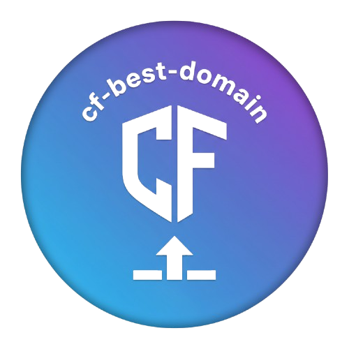

<!-- Improved compatibility of back to top link: See: https://github.com/othneildrew/Best-README-Template/pull/73 -->

<a id="readme-top"></a>

[![Contributors][contributors-shield]][contributors-url]
[![Forks][forks-shield]][forks-url]
[![Stargazers][stars-shield]][stars-url]
[![Issues][issues-shield]][issues-url]
[![project_license][license-shield]][license-url]

<br />
<div align="center">
  <a href="https://github.com/LoveDoLove/cf-best-domain">
    
  </a>

<h3 align="center">cf-best-domain</h3>

  <p align="center">
    Automate Cloudflare DNS A record management and collect the best Cloudflare IPs.
    <br />
    <a href="https://github.com/LoveDoLove/cf-best-domain"><strong>Explore the docs »</strong></a>
    <br />
    <br />
    <a href="https://github.com/LoveDoLove/cf-best-domain">View Demo</a>
    &middot;
    <a href="https://github.com/LoveDoLove/cf-best-domain/issues/new?labels=bug&template=bug-report---.md">Report Bug</a>
    &middot;
    <a href="https://github.com/LoveDoLove/cf-best-domain/issues/new?labels=enhancement&template=feature-request---.md">Request Feature</a>
  </p>
</div>

<!-- TABLE OF CONTENTS -->
<details>
  <summary>Table of Contents</summary>
  <ol>
    <li>
      <a href="#about-the-project">About The Project</a>
      <ul>
        <li><a href="#built-with">Built With</a></li>
      </ul>
    </li>
    <li>
      <a href="#getting-started">Getting Started</a>
      <ul>
        <li><a href="#prerequisites">Prerequisites</a></li>
        <li><a href="#installation">Installation</a></li>
      </ul>
    </li>
    <li><a href="#usage">Usage</a></li>
    <li><a href="#contributing">Contributing</a></li>
    <li><a href="#license">License</a></li>
    <li><a href="#contact">Contact</a></li>
    <li><a href="#acknowledgments">Acknowledgments</a></li>
  </ol>
</details>

<!-- ABOUT THE PROJECT -->

## About The Project

**cf-best-domain** is a Python-based automation tool for managing Cloudflare DNS A records and collecting the best available Cloudflare IP addresses from multiple sources. It provides scripts to fetch, parse, and store IPs, and to update Cloudflare DNS records programmatically using the Cloudflare API.

Key features:

- Collects Cloudflare IPs from various online sources and saves them to `ip.txt`.
- Automates DNS A record management (add, update, delete) for Cloudflare zones.
- Designed for easy integration and automation in server or domain management workflows.

<p align="right">(<a href="#readme-top">back to top</a>)</p>

### Built With

- Python 3.x
- [requests](https://pypi.org/project/requests/)
- [BeautifulSoup4](https://pypi.org/project/beautifulsoup4/)

<p align="right">(<a href="#readme-top">back to top</a>)</p>

## Getting Started

To get a local copy up and running, follow these steps.

### Prerequisites

- Python 3.7 or higher
- pip (Python package installer)

Install required packages:

```sh
pip install -r requirements.txt
# Or install manually:
pip install requests beautifulsoup4
```

### Installation

1. Clone the repository:
   ```sh
   git clone https://github.com/LoveDoLove/cf-best-domain.git
   cd cf-best-domain
   ```
2. (Optional) Set up your Cloudflare API token and zone information as environment variables or in your script.

<p align="right">(<a href="#readme-top">back to top</a>)</p>

## Usage

### Collect Cloudflare IPs

Run the following command to fetch and store Cloudflare IPs from multiple sources:

```sh
python collect_ips.py
```

This will generate or overwrite `ip.txt` with the latest IP addresses.

### Manage Cloudflare DNS Records

Use `bestdomain.py` to automate DNS A record management for your Cloudflare zone. Example usage:

```python
from bestdomain import get_ip_list, get_cloudflare_zone, delete_existing_dns_records, update_cloudflare_dns

ip_list = get_ip_list('ip.txt')
api_token = 'YOUR_CLOUDFLARE_API_TOKEN'
zone_id, domain = get_cloudflare_zone(api_token)
subdomain = '@'  # or specify subdomain
delete_existing_dns_records(api_token, zone_id, subdomain, domain)
update_cloudflare_dns(ip_list, api_token, zone_id, subdomain, domain)
```

See the code for more details and customization.

<p align="right">(<a href="#readme-top">back to top</a>)</p>

## Contributing

Contributions are what make the open source community such an amazing place to learn, inspire, and create. Any contributions you make are **greatly appreciated**.

If you have a suggestion that would make this better, please fork the repo and create a pull request. You can also simply open an issue with the tag "enhancement".
Don't forget to give the project a star! Thanks again!

1. Fork the Project
2. Create your Feature Branch (`git checkout -b feature/AmazingFeature`)
3. Commit your Changes (`git commit -m 'Add some AmazingFeature'`)
4. Push to the Branch (`git push origin feature/AmazingFeature`)
5. Open a Pull Request

<p align="right">(<a href="#readme-top">back to top</a>)</p>

### Top contributors:

<a href="https://github.com/LoveDoLove/cf-best-domain/graphs/contributors">
  
</a>

## License

Distributed under the MIT License. See `LICENSE` for more information.

<p align="right">(<a href="#readme-top">back to top</a>)</p>

## Contact

LoveDoLove - [@LoveDoLove](https://github.com/LoveDoLove)

Project Link: [https://github.com/LoveDoLove/cf-best-domain](https://github.com/LoveDoLove/cf-best-domain)

<p align="right">(<a href="#readme-top">back to top</a>)</p>

## Acknowledgments

- [Best-README-Template](https://github.com/othneildrew/Best-README-Template)
- [Cloudflare API Docs](https://api.cloudflare.com/)

<p align="right">(<a href="#readme-top">back to top</a>)</p>

[contributors-shield]: https://img.shields.io/github/contributors/LoveDoLove/cf-best-domain.svg?style=for-the-badge
[contributors-url]: https://github.com/LoveDoLove/cf-best-domain/graphs/contributors
[forks-shield]: https://img.shields.io/github/forks/LoveDoLove/cf-best-domain.svg?style=for-the-badge
[forks-url]: https://github.com/LoveDoLove/cf-best-domain/network/members
[stars-shield]: https://img.shields.io/github/stars/LoveDoLove/cf-best-domain.svg?style=for-the-badge
[stars-url]: https://github.com/LoveDoLove/cf-best-domain/stargazers
[issues-shield]: https://img.shields.io/github/issues/LoveDoLove/cf-best-domain.svg?style=for-the-badge
[issues-url]: https://github.com/LoveDoLove/cf-best-domain/issues
[license-shield]: https://img.shields.io/github/license/LoveDoLove/cf-best-domain.svg?style=for-the-badge
[license-url]: https://github.com/LoveDoLove/cf-best-domain/blob/main/LICENSE
