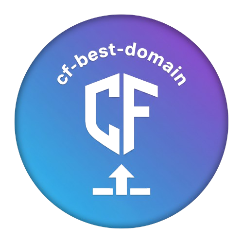

<!-- Improved compatibility of back to top link: See: https://github.com/othneildrew/Best-README-Template/pull/73 -->

<a id="readme-top"></a>

[![Contributors][contributors-shield]][contributors-url]
[![Forks][forks-shield]][forks-url]
[![Stargazers][stars-shield]][stars-url]
[![Issues][issues-shield]][issues-url]
[![project_license][license-shield]][license-url]

<br />
<div align="center">
  <a href="https://github.com/LoveDoLove/cf-best-domain">
    
  </a>

<h3 align="center">cf-best-domain</h3>

  <p align="center">
    Automate Cloudflare DNS A record management and collect the best Cloudflare IPs.
    <br />
    <a href="https://github.com/LoveDoLove/cf-best-domain"><strong>Explore the docs »</strong></a>
    <br />
    <br />
    <a href="https://github.com/LoveDoLove/cf-best-domain">View Demo</a>
    &middot;
    <a href="https://github.com/LoveDoLove/cf-best-domain/issues/new?labels=bug&template=bug-report---.md">Report Bug</a>
    &middot;
    <a href="https://github.com/LoveDoLove/cf-best-domain/issues/new?labels=enhancement&template=feature-request---.md">Request Feature</a>
  </p>
</div>

<!-- TABLE OF CONTENTS -->
<details>
  <summary>Table of Contents</summary>
  <ol>
    <li>
      <a href="#about-the-project">About The Project</a>
      <ul>
        <li><a href="#built-with">Built With</a></li>
      </ul>
    </li>
    <li>
      <a href="#getting-started">Getting Started</a>
      <ul>
        <li><a href="#prerequisites">Prerequisites</a></li>
        <li><a href="#installation">Installation</a></li>
      </ul>
    </li>
    <li><a href="#usage">Usage</a></li>
    <li><a href="#contributing">Contributing</a></li>
    <li><a href="#license">License</a></li>
    <li><a href="#contact">Contact</a></li>
    <li><a href="#acknowledgments">Acknowledgments</a></li>
  </ol>
</details>

<!-- ABOUT THE PROJECT -->

## About The Project

**cf-best-domain** is a small, focused Python automation toolkit for fetching pre-selected Cloudflare / CloudFront IPs from wetest and using them to update Cloudflare DNS A records.

This repository contains two primary scripts:

- `fetch_wetest_ips.py`: Fetches pre-selected Cloudflare / CloudFront IP lists from wetest and stores unique IPv4 addresses to `ip.txt`.
- `update_cloudflare_dns.py`: Reads IP addresses from `ip.txt` and updates a Cloudflare zone by removing existing A records for a subdomain and creating new A records from the IP list.
- GitHub Actions workflows:
  - `collect_ip_list.yml`: generates `ip.txt`
  - `update_cloudflare_dns.yml`: refreshes `ip.txt` and updates Cloudflare DNS

Key features:

- Keep a canonical `ip.txt` with pre-selected IPv4 addresses from wetest.
- Automate Cloudflare DNS A record creation and deletion using the Cloudflare API (token-based).
- Simple and stable two-step automation: fetch IPs first, then update DNS.

<p align="right">(<a href="#readme-top">back to top</a>)</p>

### Built With

- Python 3.7+
- requests (HTTP client) — https://pypi.org/project/requests/

Optional but useful for dev:

- ipaddress (stdlib) — used for IPv4 validation

<p align="right">(<a href="#readme-top">back to top</a>)</p>

## Getting Started

To get a local copy up and running, follow these steps.

### Prerequisites

- Python 3.7 or higher
- pip (Python package installer)

Install required packages:

```sh
pip install requests
```

Tip: You can create a simple `requirements.txt` with this line if you prefer:

```
requests
```

### Installation

1. Clone the repository:
   ```sh
   git clone https://github.com/LoveDoLove/cf-best-domain.git
   cd cf-best-domain
   ```
2. Set up your Cloudflare API token for the script to authenticate:

Set the wetest key as well:

```sh
export WETEST_CF2DNS_KEY="<YOUR_WETEST_KEY>"
```

Windows (cmd.exe):

```cmd
setx CF_API_TOKEN "<YOUR_CLOUDFLARE_API_TOKEN>"
setx WETEST_CF2DNS_KEY "<YOUR_WETEST_KEY>"
```

Linux / macOS (bash):

```sh
export CF_API_TOKEN="<YOUR_CLOUDFLARE_API_TOKEN>"
export WETEST_CF2DNS_KEY="<YOUR_WETEST_KEY>"
```

You can also pass a token into the script by editing the code, but environment variables are recommended.

<p align="right">(<a href="#readme-top">back to top</a>)</p>

## Usage

### Collect Cloudflare IPs

Run the following command to fetch and store candidate Cloudflare IP addresses from the configured sources:

```sh
python fetch_wetest_ips.py
```

This script will create/overwrite `ip.txt` (one IPv4 per line) in the repository root.

The script only uses the two wetest APIs and the `WETEST_CF2DNS_KEY` environment variable.

### Manage Cloudflare DNS Records

`update_cloudflare_dns.py` automates deletion of existing A records for a subdomain and creation of new A records for each IP in an IP list.

Example (from the command line if you import functions or run the script directly):

```python
import os

from update_cloudflare_dns import get_ip_list, get_cloudflare_zone, delete_existing_dns_records, update_cloudflare_dns

# ip_list can be a local file like 'ip.txt' or a remote URL that returns one IP per line
ip_list = get_ip_list('ip.txt')
api_token = os.getenv('CF_API_TOKEN')
zone_id, domain = get_cloudflare_zone(api_token)
subdomain = 'api'  # change as needed; use '@' for root
delete_existing_dns_records(api_token, zone_id, subdomain, domain)
update_cloudflare_dns(ip_list, api_token, zone_id, subdomain, domain)
```

Note: The script uses Cloudflare token-based authentication. The environment variable `CF_API_TOKEN` should be set with a token that has permission to list and modify DNS records for the zone(s) used.

The repository currently ships with a single `api` mapping in `update_cloudflare_dns.py`; add more subdomains there if needed.

<p align="right">(<a href="#readme-top">back to top</a>)</p>

## Contributing

Contributions are what make the open source community such an amazing place to learn, inspire, and create. Any contributions you make are **greatly appreciated**.

If you have a suggestion that would make this better, please fork the repo and create a pull request. You can also simply open an issue with the tag "enhancement".
Don't forget to give the project a star! Thanks again!

1. Fork the Project
2. Create your Feature Branch (`git checkout -b feature/AmazingFeature`)
3. Commit your Changes (`git commit -m 'Add some AmazingFeature'`)
4. Push to the Branch (`git push origin feature/AmazingFeature`)
5. Open a Pull Request

<p align="right">(<a href="#readme-top">back to top</a>)</p>

### Top contributors:

<a href="https://github.com/LoveDoLove/cf-best-domain/graphs/contributors">
  
</a>

## License

Distributed under the MIT License. See `LICENSE` for more information.

<p align="right">(<a href="#readme-top">back to top</a>)</p>

## Contact

LoveDoLove - [@LoveDoLove](https://github.com/LoveDoLove)

Project Link: [https://github.com/LoveDoLove/cf-best-domain](https://github.com/LoveDoLove/cf-best-domain)

<p align="right">(<a href="#readme-top">back to top</a>)</p>

## Acknowledgments

- [Best-README-Template](https://github.com/othneildrew/Best-README-Template)
- [Cloudflare API Docs](https://api.cloudflare.com/)

<p align="right">(<a href="#readme-top">back to top</a>)</p>

[contributors-shield]: https://img.shields.io/github/contributors/LoveDoLove/cf-best-domain.svg?style=for-the-badge
[contributors-url]: https://github.com/LoveDoLove/cf-best-domain/graphs/contributors
[forks-shield]: https://img.shields.io/github/forks/LoveDoLove/cf-best-domain.svg?style=for-the-badge
[forks-url]: https://github.com/LoveDoLove/cf-best-domain/network/members
[stars-shield]: https://img.shields.io/github/stars/LoveDoLove/cf-best-domain.svg?style=for-the-badge
[stars-url]: https://github.com/LoveDoLove/cf-best-domain/stargazers
[issues-shield]: https://img.shields.io/github/issues/LoveDoLove/cf-best-domain.svg?style=for-the-badge
[issues-url]: https://github.com/LoveDoLove/cf-best-domain/issues
[license-shield]: https://img.shields.io/github/license/LoveDoLove/cf-best-domain.svg?style=for-the-badge
[license-url]: https://github.com/LoveDoLove/cf-best-domain/blob/main/LICENSE
